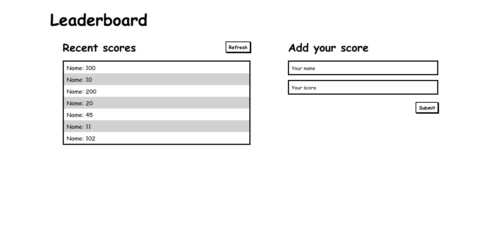

# Leaderboard App

> The leaderboard website displays scores submitted by different players. It also allows you to submit your score. All data is preserved thanks to the external Leaderboard API service.

## Screenshot

## Built With

- HTML, Javascript
- Sass, Babel, PostCss
- WebPack5, CLI, gh-pages, gitflow

## Live Demo

[Live Demo Link](https://jssol.github.io/leaderboard-app/)

## Getting Started

To get a local copy up and running follow these simple example steps.

### Prerequisites

A working browser, preferrably Chrome or Firefox

### Setup

`git clone `

### Install

`npm install`

### Usage

`npm start`

### Run tests

`npm test`

## Authors

👤 **Jonathan Sivahera**

- GitHub: [@jssol](https://github.com/jssol)
- Twitter: [@jsivahera](https://twitter.com/jsivahera)
- LinkedIn: [@jsivahera](https://linkedin.com/in/jsivahera)

## 🤝 Contributing

Contributions, issues, and feature requests are welcome!

Feel free to check the [issues page](../../issues/).

## Show your support

Give a ⭐️ if you like this project!

## Acknowledgments

- Hat tip to anyone whose code was used
- Inspiration
- etc

## 📝 License

This project is [MIT](./MIT.md) licensed.
